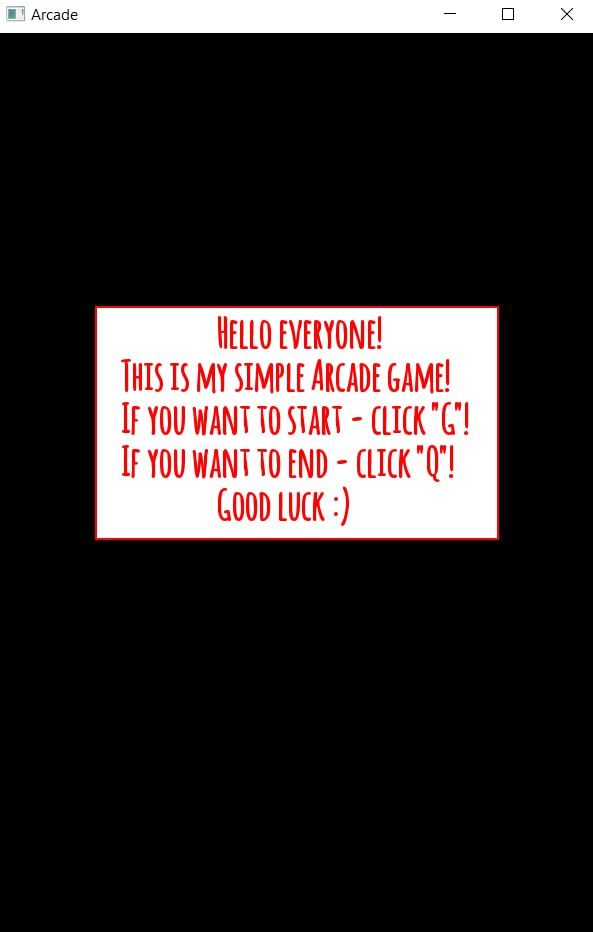
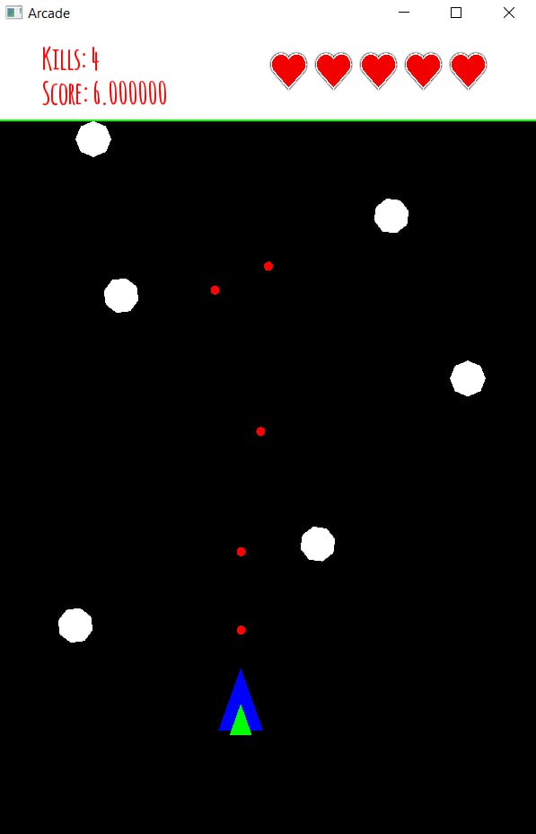
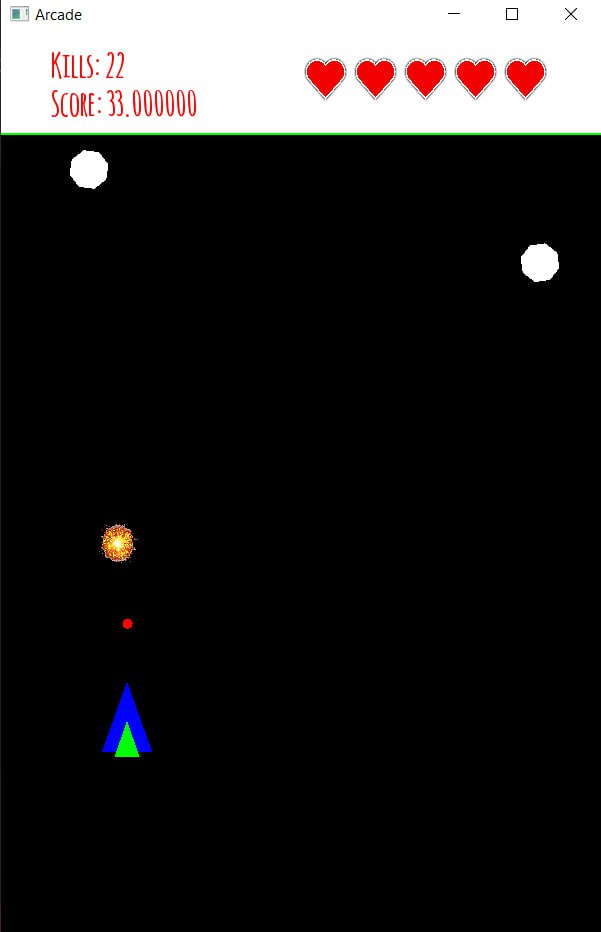

# Arcade
This is endless, singleplayer Arcade-shooting game.
## Table of contents
* [General info](#general-info)
* [Technologies and features](#technologies)
* [Setup](#setup)

## General info
Once again I used SFML library to link objects and human-computer communication, Audacity for sound correction and customisation. 

This time, in order to correctly implement the actions and movements of projectiles and asteroids - I used a vector of classes, that is, when you press the "Space" - creates an object projectile, which is added to the vector and further used in the loop. Also, to regulate the number of projectiles, I introduced a reload time. 

```
if (Keyboard::isKeyPressed(Keyboard::Space)) 
{
    sound1.play();
    if (shootClock.getElapsedTime().asSeconds() >= plane.shootCooldown)
    {
        projectiles.push_back(newProjectile);
        shootClock.restart();
    }
}
```

In the case of the asteroids, I did about the same thing I did with the projectiles. They are generated at a random point on the oX plane and then start moving towards the player. There is also a cooldown to control the number of asteroids.

```
float popochka = rand() % (550 - 50 + 1) + 50;
Astro newAstro(Vector2f(popochka, 100), Vector2f(0, 0.03f));
if (for_astro.getElapsedTime().asSeconds() >= 1.0f)
{
    astro.push_back(newAstro);
    for_astro.restart();
}
```

Of course each projectile has damage, and each asteroid has a number of XP. The damage of a projectile depends on the type of aircraft, and the XP of an asteroid depends on its type. You can see all this by looking at the class declaration. 
We are greeted by an initial menu with brief information, after which the gameplay immediately begins.



Next we see the number of asteroids destroyed, the score we have while doing so and the amount of our health. Also, our aircraft appears on the map, it has the most primitive control - WASD. Shoot on the "Spacebar".



If an asteroid has a critical amount of health, it explodes, so we can see the corresponding sprite. The mechanism is also quite simple - due to the fact that the asteroid and the projectile are of the same type, it is much easier to work with them. Going into the loop - we look for correlations between projectiles and asteroids, then, if there is a correlation, we remove XP from the asteroid while destroying the projectile. If the asteroid has no XP left - we remove it and a sprite appears in its place for 1 second.

```
for (auto it = projectiles.begin(); it != projectiles.end();) 
{
    bool projectileRemoved = false; 
    for (auto astroIt = astro.begin(); astroIt != astro.end(); ++astroIt) 
    {
        if (it->shape.getGlobalBounds().intersects(astroIt->astro.getGlobalBounds())) 
        {
            
            astroIt->health -= it->damage;
            
            it = projectiles.erase(it);
            projectileRemoved = true;
            
            if (astroIt->health <= 0) 
            {
                kills++;
                suma = kills * koef;

                Sprite exp1;
                exp1.setTexture(expo);
                exp1.setPosition(astroIt->astro.getPosition().x - 17, astroIt->astro.getPosition().y - 20);
                exp1.setOrigin(10.0f, 10.0f);
                exp1.setScale(50.0f / exp1.getLocalBounds().width, 50.0f / exp1.getGlobalBounds().height);
                explosions.push_back(make_pair(exp1, Clock()));
                astroIt = astro.erase(astroIt);
                
                sound.play();
            }
            break; 
        }
    }
    if (!projectileRemoved) 
    {
        it++; 
    }
}
```


The game stops if you lose all your health, health is lost if the asteroid reaches the bottom edge.


